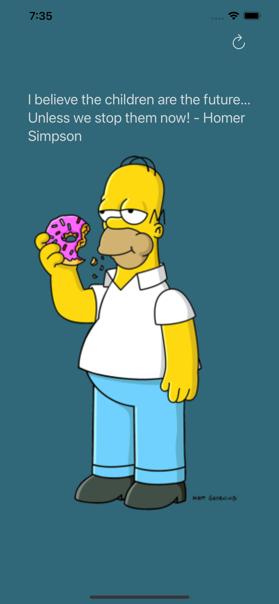
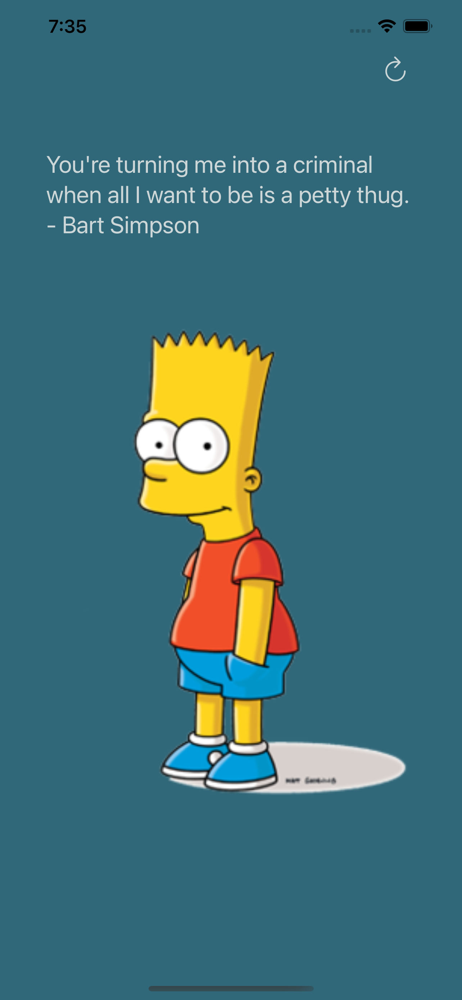

<!-- PROJECT LOGO -->
<br />
<div align="center">
  <a href="https://github.com/github_username/repo_name">
    
  </a>

<h3 align="center">Simpsons Quotes Generator</h3>

  <p align="center">
    An app that generates quotes from simpsons
  </p>
</div>


<!-- ABOUT THE PROJECT -->
## About The Project

                       


A simple MVVM playground that turned into something beautiful, Simpsons quote generator...
The app was built using basic MVVM principles.
API used: 

* thesimpsonsquoteapi.glitch.me


### Built With

* Xcode 13
* Swift programming language


### Installation

1. Clone the repo
   ```sh
   git clone https://github.com/Sevenfortyseven/TheSimpsonsQuoteGenerator.git
   ```


